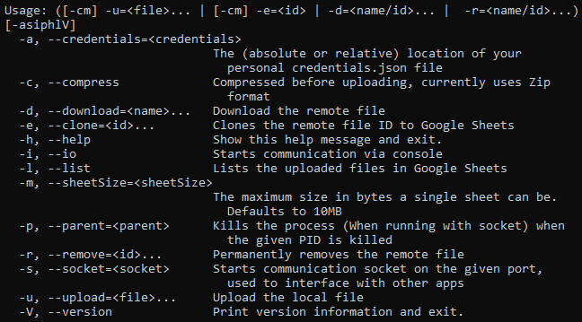
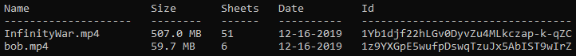

# HolySheet

HolySheet is a program that allows you to store arbitrary files onto Google Sheets, which does not lower storage quota on Google Drive. This is inspired by [uds](https://github.com/stewartmcgown/uds), however it can only store ~710KB of data per doc due to the use of Base64 and Docs limitations, and only has CLI usage.

HolySheet uses Google Sheets, which has an undocumented maximum 25.9MB* of data capacity in my less-than-professional testing. A modified Base91 algorithm is also used to efficiently convert arbitrary files into text to work with Sheets. Compression to Zip is also offered, with other compression methods planned. This repo is the CLI/Server for HolySheet, with [SheetyGUI](https://github.com/RubbaBoy/SheetyGUI) being the GUI application.

\* This could be more, it arbitrarily throws 500 ISE's at upload requests with more (A more stable and recommended number is 10MB)

## Installing

Installing HolySheet only requires a few steps.

1. Clone the repo into an IDE as a Gradle project
2. Enable the [Google Drive API](https://developers.google.com/drive/api/v3/quickstart/java) and [Sheets API](https://developers.google.com/sheets/api/quickstart/java)
3. Download the client configuration as `credentials.json` into the project's root
4. Run `gradle run`

Usage:

Remote file listing:

