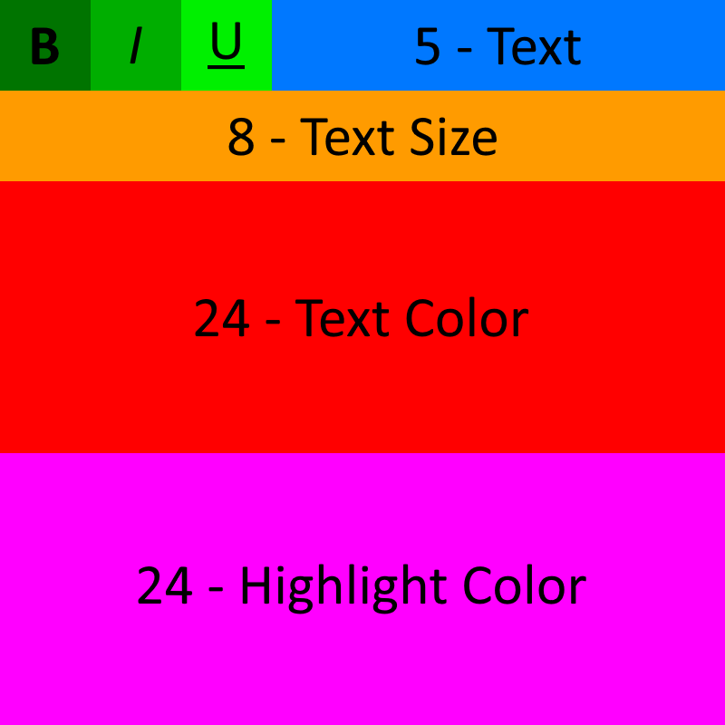

# DocStore

DocStore is a program that allows you to store arbitrary files onto Google Docs, which does not lower storage quota on Google Drive. This is inspired by [uds](https://github.com/stewartmcgown/uds), however it can only store ~710KB of data per doc due to the use of Base64, and only has CLI usage.

DocStore uses a custom algorithm maximize Google's 1.02M character limit on google docs by losslessly storing 64 bits per character in google docs, allowing for a theoretical limit of 8,160KB of storage per google doc, before any other compression method (Such as zipping the file). In the future this amount could theoretically be expanded, however this could cause complications as numbers above a standard Java long would be required, and could cause speed issues with bigger files.

The following is a breakdown of how each Google Drive character is stored:

| Bytes | Representation     |
| ----- | ------------------ |
| 1     | Bold Toggle        |
| 1     | Italics Toggle     |
| 1     | Underline Toggle   |
| 5     | Character (Mapped) |
| 8     | Text Size          |
| 24    | Text Color         |
| 24    | Highlight Color    |

And an image for graphical reference:

