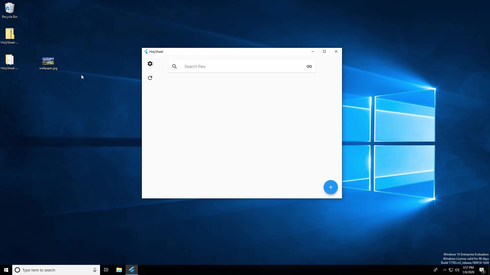

<h1 align="center">HolySheet</h1>
<p align="center"><i>Store any file, of any size to Google Sheets</i></p>
<hr><p align="center">
  <a href="http://hits.dwyl.io/RubbaBoy/HolySheet"></a>
  
  <a href="https://wakatime.com/badge/github/RubbaBoy/HolySheet"></a>
  <a href="https://github.com/RubbaBoy/HolySheet/issues"></a>
  <a href="https://github.com/RubbaBoy/HolySheet/graphs/contributors"></a>
  <a href="https://github.com/RubbaBoy/HolySheet/blob/master/LICENSE.txt"></a>
</p>

HolySheet is a program that allows you to store arbitrary files onto Google Sheets, which does not lower storage quota on Google Drive. This is inspired by [uds](https://github.com/stewartmcgown/uds), however it can only store ~710KB of data per doc due to the use of Base64 and Docs limitations, and only has CLI usage.

HolySheet uses Google Sheets, which has an undocumented maximum 25.9MB* of data capacity in my less-than-professional testing. A modified Base91 algorithm is also used to efficiently convert arbitrary files into text to work with Sheets. Compression to Zip is also offered, with other compression methods planned.

For the official GUI application, see [SheetyGUI](https://github.com/RubbaBoy/SheetyGUI).

*\* This could be more, it arbitrarily throws 500 ISE's at upload requests with more (A more stable and recommended number is 10MB)*

## How it works

- Google Sheets do not affect Drive quota
- Google Sheets allow for (an undocumented) 10+MB per sheet
- Base91 turns files into text with ~22% overhead
- A [JSON protocol](https://github.com/RubbaBoy/HolySheet/blob/master/InterfaceProtocol.md) allows for separated GUI, or other program interfacing

## Installing

Installing HolySheet only requires a few steps.

1. Clone the repo into an IDE as a Gradle project
2. Enable the [Google Drive API](https://developers.google.com/drive/api/v3/quickstart/java) and [Sheets API](https://developers.google.com/sheets/api/quickstart/java)
3. Download the client configuration as `credentials.json` into the project's root
4. Run `gradle run`

Usage:

```bash
Usage: ([-cm] -u=<file>... | [-cm] -e=<id> | -d=<name/id>... |  -r=<name/id>...)
[-asixphlV]
  -a, --credentials=<credentials>
                             The (absolute or relative) location of your
                               personal credentials.json file
  -c, --compress             Compressed before uploading, currently uses Zip
                               format
  -d, --download=<name>...   Download the remote file
  -e, --clone=<id>...        Clones the remote file ID to Google Sheets
  -h, --help                 Show this help message and exit.
  -i, --io                   Starts communication via console
  -l, --list                 Lists the uploaded files in Google Sheets
  -m, --sheetSize=<sheetSize>
                             The maximum size in bytes a single sheet can be.
                               Defaults to 10MB
  -p, --parent=<parent>      Kills the process (When running with socket) when
                               the given PID is killed
  -r, --remove=<id>...       Permanently removes the remote file
  -s, --socket=<socket>      Starts communication socket on the given port,
                               used to interface with other apps
  -u, --upload=<file>...     Upload the local file
  -V, --version              Print version information and exit.
  -x, --codeexec             Enables Java code execution required on some
                               clients. Not recommended while running with
                               sockets.
```


Remote file listing (`-l`)

```bash
Name                   Size       Sheets   Owner                  Date         Id
--------------------   --------   ------   --------------------   ----------   ---------------------------------
bob.mp4                59.7 MB    6        Adam Yarris            01-03-2020   16dHIeHW82BYgBgfMlp3SQ8D1rhRmRO0F
ready.zip              570.4 MB   57       Amazon Accounts        01-01-2020   1qYoOYBXeWoRe71-cSxgNPiFrkoxIFwS9
InfinityWar.mp4        507.0 MB   51       Amazon Accounts        12-16-2019   1Yb1djf22hLGv0DyvZu4MLkczap-k-qZC
bob.mp4                59.7 MB    6        Amazon Accounts        12-16-2019   1z9YXGpE5wufpDswqTzuJx5AbIST9wIrZ
```

## GUI Demo

The following is a video of the Installation and usage of SheetyGUI. For just a usage demo, skip to [2:06](https://youtu.be/W3wyBj26rsg?t=126)

[](https://youtu.be/W3wyBj26rsg)

https://youtu.be/W3wyBj26rsg

